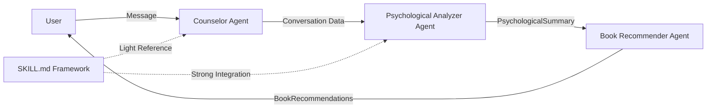

# 심리 상담 챗봇 + 도서 추천 시스템 (CrewAI Multi-Agent)

**CrewAI 멀티 에이전트 시스템** 기반 심리 상담 및 네이버 도서 검색 API를 활용한 맞춤형 도서 추천 시스템입니다.

## 🤖 멀티 에이전트 아키텍처

이 시스템은 **3개의 전문 AI 에이전트**가 순차적으로 협력하여 작동합니다:

1. **Counselor Agent** 🧑‍⚕️
   - 공감적 경청과 핵심 정보 수집
   - SKILL.md 사회심리학 원리 적용
   - **LLM이 정보 충분성을 자율 판단** (Tool Calling)
   - 3-6턴 자연스러운 대화

2. **Psychological Analyzer Agent** 🧠
   - SKILL.md 프레임워크 기반 6단계 심층 분석
   - 인지/사회/임상/발달/신경과학 통합
   - Biopsychosocial 모델 적용

3. **Book Recommender Agent** 📚
   - 심리 분석 결과 기반 맞춤 도서 검색
   - 네이버 도서 API 활용
   - 독서 치료(Bibliotherapy) 전문

## 📋 목차

- [주요 기능](#-주요-기능)
- [기술 스택](#-기술-스택)
- [프로젝트 구조](#-프로젝트-구조)
- [설치 방법](#-설치-방법)
- [사용 방법](#-사용-방법)
- [심층 분석 프로세스](#-심층-분석-프로세스-skillmd-기반)
- [하이브리드 도서 랭킹 알고리즘](#-하이브리드-도서-랭킹-알고리즘)
- [API 엔드포인트](#-api-엔드포인트)
- [예시](#-예시)
- [환경 변수](#-환경-변수)
- [문제 해결](#-문제-해결)

## ✨ 주요 기능

### 1. 심리 상담 챗봇 (경청 중심)
- **공감적 경청**: 감정 반영과 비판단적 수용
- **탐색적 질문**: 부드럽고 개방적인 질문으로 이해 심화
- **지지적 존재**: 따뜻한 격려와 강점 발견
- 짧고 자연스러운 대화 흐름 (2-4문장)

### 2. 심층 심리 분석 (SKILL.md 기반)
- **6단계 체계적 분석**: Tool Calling을 활용한 전문 분석
  1. 심리학적 현상 정의
  2. 이론 적용 (인지, 사회, 임상, 발달, 신경과학)
  3. 인지 과정 분석 (편향, 휴리스틱, 정보처리)
  4. 감정 및 동기 요인 검토
  5. 사회적 및 상황적 영향 평가
  6. 정신건강 차원 평가
- **Biopsychosocial 통합**: 생물학적, 심리적, 사회적 요인 통합 분석
- 5회 이상 대화 후 자동 실행

### 3. 도서 추천 (하이브리드 랭킹)
- **네이버 도서 검색 API 활용**: 실시간 도서 데이터
- **심리 분석 결과 기반 맞춤 검색**: 키워드 자동 생성
- **하이브리드 랭킹 알고리즘**:
  - 📅 **최신성 점수** (40%): 출판일 기반 지수 감쇠
  - 🎯 **관련도 점수** (40%): 검색 순위 기반 로그 스케일
  - 📚 **장르 매칭 점수** (20%): 사용자 선호 장르 키워드 매칭
- **Claude AI 추천 이유**: 각 도서별 심리적 연관성 설명

## 🛠 기술 스택

### Multi-Agent Framework
- **CrewAI** - 멀티 에이전트 오케스트레이션
- **Sequential Workflow** - 순차적 에이전트 실행

### Backend
- **Python 3.12+** - 프로그래밍 언어
- **Pydantic** - 데이터 검증 및 모델링
- **uv** - 빠른 Python 패키지 관리자 (선택사항)

### AI/ML
- **Anthropic Claude Sonnet 4** - 최신 언어 모델
- **Tool Calling** - 구조화된 심리 분석
- **SKILL.md Framework** - 심리학 분석 프레임워크
- **Hybrid Ranking Algorithm** - 다차원 도서 추천 알고리즘
  - 지수 감쇠 기반 최신성 평가
  - 로그 스케일 관련도 점수
  - 키워드 기반 장르 매칭

### External APIs
- **Naver Search API** - 도서 검색

### UI
- **Gradio** - 사용자 친화적 웹 인터페이스

## 📁 프로젝트 구조 (CrewAI Multi-Agent)

```
pagemind/
├── core_crewai/                   # 핵심 모듈 (CrewAI 기반)
│   ├── __init__.py                # 패키지 초기화
│   ├── config.py                  # 설정 관리 (API 키, CrewAI 설정)
│   ├── models.py                  # Pydantic 데이터 모델
│   │   ├── Message, PsychologicalSummary
│   │   └── BookRecommendation, CounselingResult
│   │
│   ├── agents.py                  # CrewAI 에이전트 정의
│   │   ├── create_counselor_agent()
│   │   ├── create_psychological_analyzer_agent()
│   │   └── create_book_recommender_agent()
│   │
│   ├── tasks.py                   # CrewAI 태스크 정의
│   │   ├── create_counseling_task()
│   │   ├── create_analysis_task()
│   │   └── create_book_recommendation_task()
│   │
│   ├── crew_orchestrator.py      # 멀티 에이전트 오케스트레이터
│   │   └── CrewOrchestrator (워크플로우 관리)
│   │
│   ├── counselor_tools.py         # Counselor Agent Tool (분석 준비 신호)
│   ├── crewai_tools.py            # CrewAI Tools (네이버 도서 검색)
│   └── book_reranker.py           # 하이브리드 도서 랭킹 알고리즘
│       └── 날짜/관련도/장르 기반 스마트 재정렬
│
├── app_gradio.py                  # Gradio 웹 앱 (메인)
│   └── CrewOrchestrator 통합
│
├── SKILL.md                       # 심리학 분석 프레임워크 (참고 문서)
├── requirements.txt               # Python 의존성 (CrewAI 포함)
├── pyproject.toml                 # 프로젝트 메타데이터 (uv 패키지 관리)
├── uv.lock                        # uv 의존성 잠금 파일
└── .env                           # 환경 변수
```

### 아키텍처 플로우



## 🚀 설치 방법

### 1. 필수 요구사항

- **Python 3.12 이상** (필수)
- **pip** 또는 **uv** 패키지 관리자
- **네이버 개발자 계정** (API 키 필요)
- **Anthropic API 키**

#### Python 버전 확인 및 설치 (Mac)

```bash
# 현재 Python 버전 확인
python3 --version

# Python 3.12 미만인 경우 Homebrew로 설치 (권장)
brew install python@3.12

# 또는 pyenv 사용
brew install pyenv
pyenv install 3.12.0
pyenv local 3.12.0

# 설치 후 버전 확인
python3.12 --version
```

**중요**: `crewai>=0.28.0`은 Python 3.10 이상이 필요하며, 이 프로젝트는 Python 3.12+를 권장합니다.

### 2. 프로젝트 클론

```bash
git clone <repository-url>
cd play-with-mcp
```

### 3. 의존성 설치

#### 방법 1: pip 사용 (기본)

```bash
pip install -r requirements.txt
```

#### 방법 2: uv 사용 (빠른 설치, 권장)

```bash
# uv 설치 (처음 한 번만)
pip install uv
# 또는 Mac: brew install uv

# Python 3.12 명시적 설정 (필수!)
uv python pin 3.12

# 가상환경 생성 및 의존성 설치
uv sync  # pyproject.toml 기반 (빈 dependencies인 경우)
uv pip install -r requirements.txt  # requirements.txt 기반

# 앱 실행 (uv 환경에서)
uv run python app_gradio.py
```

**중요**: uv 환경에서는 `uv python pin 3.12`로 Python 버전을 명시적으로 설정해야 합니다.

주요 의존성:
- `crewai>=0.28.0` - 멀티 에이전트 프레임워크
- `anthropic>=0.40.0` - Claude AI
- `gradio>=4.0.0` - 웹 UI
- `pydantic>=2.5.0` - 데이터 모델

### 4. 환경 변수 설정

`.env` 파일을 생성하고 API 키를 설정합니다:

```bash
cp env.example .env
```

`.env` 파일 내용:
```env
ANTHROPIC_API_KEY=your-anthropic-api-key
NAVER_CLIENT_ID=your-naver-client-id
NAVER_CLIENT_SECRET=your-naver-client-secret
```

### 5. 네이버 API 키 발급

1. [네이버 개발자 센터](https://developers.naver.com/) 접속
2. 애플리케이션 등록
3. 검색 API 사용 신청
4. Client ID와 Client Secret 확인

## 💻 사용 방법

### Gradio 웹 앱 실행

#### 방법 1: 일반 Python 환경

```bash
python app_gradio.py
# 또는
python3.12 app_gradio.py
```

#### 방법 2: uv 환경 (권장)

```bash
# uv 환경에서 실행
uv run python app_gradio.py
```

브라우저가 자동으로 열립니다 (http://localhost:7860)

**사용 흐름:**

1. **상담 단계** (1-5회)
   - 챗봇과 자유롭게 대화
   - 경청과 탐색 질문 중심의 공감적 상담
   - 짧고 따뜻한 응답

2. **자동 분석** (5회 대화 후)
   - SKILL.md 기반 6단계 심층 분석 자동 실행
   - Tool Calling으로 구조화된 심리학적 평가
   - 주요 고민, 감정, 인지 패턴, 권장 전략 제시

3. **도서 추천** (분석 후)
   - "📚 책 추천받기" 버튼 클릭
   - 분석 결과 기반 맞춤 도서 검색
   - 각 도서별 추천 이유 제공

**주요 기능:**
- 실시간 채팅 인터페이스
- 대화 기록 초기화/내보내기
- 심리 분석 결과 시각화
- 추천 도서 상세 정보 (표지, 링크 포함)

## 🧪 테스트

### 1. 통합 테스트 실행

```bash
python test_crewai_integration.py
```

테스트 내용:
- **테스트 1**: Counselor Agent와 대화
- **테스트 2**: Psychological Analyzer Agent 분석
- **테스트 3**: Book Recommender Agent 추천
- **테스트 4**: 전체 워크플로우 (Sequential)

### 2. Gradio 웹 앱 테스트

```bash
python app_gradio.py
```

1. **기본 상담 모드**: Counselor Agent와 대화
2. **심층 분석**: 5회 이상 대화 후 Analyzer Agent 자동 실행
3. **도서 추천**: Recommender Agent를 통한 맞춤 도서 제공

## 🔬 심층 분석 프로세스 (SKILL.md 기반)

### 멀티 에이전트 아키텍처

시스템은 **CrewAI Sequential Workflow**를 따릅니다:

- **Counselor Agent**: 경청과 데이터 수집 (가볍고 빠름, 3-5턴)
- **Psychological Analyzer Agent**: SKILL.md 프레임워크 기반 체계적 분석 (깊고 전문적)
- **Book Recommender Agent**: 심리 분석 결과 기반 맞춤 도서 추천

### SKILL.md 통합 수준

- **Counselor Agent**: 🔵 Light Integration
  - 사회심리학의 공감 원리 참고
  - 주요 목표는 정보 수집
  
- **Psychological Analyzer Agent**: 🔴 Strong Integration
  - SKILL.md 전체 프레임워크 내장
  - 6단계 체계적 분석 수행
  - 5개 이론적 기초 (인지/사회/임상/발달/신경과학) 적용

### 6단계 Tool Calling 분석

5회 이상 대화 후, Psychological Analyzer Agent (CrewAI)가 SKILL.md 프레임워크를 활용하여 다음 6단계 분석을 수행합니다:

#### 1단계: 심리학적 현상 정의
- 관찰되는 행동/사고 패턴 식별
- 상황적 맥락 파악 (누가, 언제, 어디서)
- 분석 수준 결정 (개인/대인관계/집단)
- 관련 심리학 영역 선정

#### 2단계: 이론 적용
- **인지심리학**: Dual-process, 편향, 휴리스틱
- **사회심리학**: 귀인, 동조, 상황의 힘
- **임상심리학**: CBT, Stress-Coping, DSM-5
- **발달심리학**: 생애주기, 애착, 발달 과제
- **신경과학**: 뇌 구조, 신경전달물질, 스트레스 생리

#### 3단계: 인지 과정 분석
- 인지 편향 식별 (확증편향, 가용성 휴리스틱 등)
- 사고 패턴 분석 (자동적 사고, 인지 왜곡)
- 의사결정 과정 (System 1/2)
- 정보처리 방식 (주의, 기억, 판단)

#### 4단계: 감정 및 동기 요인
- 주요 감정 상태 파악
- 감정 조절 방식 평가
- 동기 분석 (자율성, 역량, 관계성)
- 심리적 욕구 평가 (Maslow, SDT)

#### 5단계: 사회적 및 상황적 영향
- 상황의 힘 분석 (권위, 규범, 역할)
- 사회적 영향 (동조, 복종, 설득)
- 집단 역학 (집단사고, 사회적 촉진)
- 개인-상황 상호작용

#### 6단계: 정신건강 평가
- 고통 수준 평가 (minimal/mild/moderate/severe)
- 일상 기능 영향 분석
- 위험 요인 식별 (취약성)
- 보호 요인 파악 (회복탄력성)
- 임상적 고려사항 (정상 vs 병리적)

### Biopsychosocial 통합

모든 분석은 다음 세 차원을 통합합니다:

- **생물학적**: 유전, 뇌 구조, 신경전달물질, 신체 건강
- **심리적**: 인지, 감정, 성격, 학습 이력
- **사회적**: 관계, 문화, 사회경제적 지위, 차별

### 최종 산출물

분석 완료 후 다음 정보가 생성됩니다:

- 주요 고민 목록
- 감정 상태 분석
- 인지 패턴 식별
- 권장 전략 제시
- 도서 검색 키워드 (심리학 용어 + 일반 단어)

## 📊 하이브리드 도서 랭킹 알고리즘

### 알고리즘 개요

Book Recommender Agent는 네이버 도서 API 검색 결과를 **하이브리드 랭킹 알고리즘**으로 재정렬하여 최적의 도서를 추천합니다.

### 3가지 평가 차원

#### 1. 최신성 점수 (Recency Score) - 40%

```python
score = 0.5 ^ (years_ago / half_life)
```

- **지수 감쇠 모델**: 출판일이 오래될수록 점수 감소
- **반감기 3년**: 3년 전 책은 최근 책의 50% 점수
- **범위**: 0.0 ~ 1.0 (최근 책일수록 1.0에 가까움)

#### 2. 관련도 점수 (Relevance Score) - 40%

```python
score = 1.0 - log(1 + normalized_position * 9) / log(10)
```

- **로그 스케일**: 검색 결과 상위권일수록 높은 점수
- **위치 기반**: 네이버 API의 검색 순위 반영
- **범위**: 0.0 ~ 1.0 (1위는 1.0, 순위가 낮을수록 감소)

#### 3. 장르 매칭 점수 (Genre Match Score) - 20%

```python
keywords = genre_keywords[preferred_genre]
matches = count_keyword_matches(title, description, keywords)
```

- **키워드 매칭**: 제목 + 설명에서 장르별 키워드 탐색
- **지원 장르**:
  - 자기계발 (성장, 습관, 목표, 동기부여)
  - 심리학 (마음, 감정, 치유, 회복)
  - 소설 (이야기, 픽션, 문학)
  - 에세이 (수필, 일상, 경험)
  - 인문 (철학, 사회, 역사)
  - 경제/경영 (비즈니스, 마케팅, 리더십)
- **점수**: 1.0 (강한 매칭) / 0.7 (약한 매칭) / 0.3 (매칭 없음)

### 최종 점수 계산

```python
final_score = 0.4 * recency + 0.4 * relevance + 0.2 * genre_match
```

**가중치 설계 철학:**
- **최신성 40%**: 심리학/자기계발 분야는 최신 연구와 트렌드가 중요
- **관련도 40%**: 검색 알고리즘의 키워드 매칭 신뢰
- **장르 매칭 20%**: 사용자 선호 반영 (보조 지표)

### 예시

| 책 제목 | 출판일 | 순위 | 최신성 | 관련도 | 장르 | **최종 점수** |
|---------|--------|------|--------|--------|------|---------------|
| 마음챙김 명상 | 2024-03 | 1위 | 0.95 | 1.00 | 1.00 | **0.980** |
| 감정 조절의 기술 | 2022-08 | 3위 | 0.74 | 0.85 | 0.70 | **0.756** |
| 행복의 심리학 | 2018-01 | 2위 | 0.32 | 0.92 | 1.00 | **0.696** |

→ "마음챙김 명상"이 최신성과 관련도 모두 높아 1순위 추천

## 📡 API 엔드포인트

### 1. 루트 엔드포인트

```http
GET /
```

**응답:**
```json
{
  "message": "심리 상담 챗봇 + 도서 추천 시스템 API",
  "version": "1.0.0",
  "endpoints": {
    "chat": "/chat",
    "analyze_and_recommend": "/analyze-and-recommend",
    "conversation": "/conversation/{conversation_id}"
  }
}
```

### 2. 심리 상담 대화

```http
POST /chat
```

**요청 본문:**
```json
{
  "messages": [
    {
      "role": "user",
      "content": "요즘 직장에서 스트레스를 많이 받아요."
    }
  ],
  "user_id": "user123"
}
```

**응답:**
```json
{
  "response": "직장에서 스트레스를 많이 받으시는군요. 힘드시겠어요...",
  "conversation_id": "user123"
}
```

### 3. 상담 분석 및 도서 추천

```http
POST /analyze-and-recommend
```

**요청 본문:**
```json
{
  "messages": [
    {
      "role": "user",
      "content": "요즘 직장에서 스트레스를 많이 받아요. 불안하고 잠도 잘 안 와요."
    },
    {
      "role": "assistant",
      "content": "힘드시겠어요. 구체적으로 어떤 상황이 가장 스트레스를 주나요?"
    },
    {
      "role": "user",
      "content": "상사가 계속 무리한 요구를 하는데 거절하지 못하겠어요."
    }
  ],
  "conversation_id": "conv123"
}
```

**응답:**
```json
{
  "summary": {
    "main_concerns": ["직장 스트레스", "상사와의 관계", "거절 불가"],
    "emotions": ["불안", "스트레스", "무력감"],
    "cognitive_patterns": ["파국화", "과도한 책임감"],
    "recommendations": ["경계 설정", "자기주장 연습", "스트레스 관리"],
    "keywords": ["스트레스 관리", "자기주장", "불안 극복"]
  },
  "recommended_books": [
    {
      "title": "스트레스 제로",
      "author": "홍길동",
      "publisher": "ABC 출판사",
      "description": "스트레스 관리와 마음챙김 기법...",
      "isbn": "1234567890",
      "cover_image": "https://...",
      "link": "https://...",
      "relevance_reason": "직장 스트레스와 불안 관리에 도움이 되는 구체적인 기법을 제공합니다."
    }
  ],
  "generated_at": "2025-01-10T12:00:00"
}
```

### 4. 대화 조회

```http
GET /conversation/{conversation_id}
```

**응답:**
```json
{
  "conversation_id": "user123",
  "messages": [...],
  "message_count": 5
}
```

### 5. 헬스 체크

```http
GET /health
```

**응답:**
```json
{
  "status": "healthy",
  "timestamp": "2025-01-10T12:00:00",
  "services": {
    "chatbot": "operational",
    "analyzer": "operational",
    "recommender": "operational"
  }
}
```

## 📝 예시

### Gradio 웹 데모 사용 예시

#### 1. 심리 상담 시작

**상담 탭**에서 메시지 입력:
```
사용자: "요즘 직장에서 스트레스를 많이 받아요. 상사가 계속 무리한 요구를 하는데 거절하지 못하겠어요."

챗봇: "직장에서 스트레스를 많이 받으시는군요. 특히 상사의 무리한 요구에 거절하지 못하는 상황이 힘드시겠어요..."
```

#### 2. 대화 분석 및 도서 추천

**분석 및 추천 탭**에서 🔍 버튼 클릭:

**심리 분석 결과:**
- 주요 고민: 직장 스트레스, 거절 불가, 자기주장 어려움
- 감정 상태: 불안, 무력감, 스트레스
- 인지 패턴: 파국화, 과도한 책임감
- 권장 전략: 경계 설정, 자기주장 연습

**추천 도서:**
1. 스트레스 제로 (홍길동 저)
   - 추천 이유: 직장 스트레스 관리 기법 제공
2. 거절할 수 있는 용기 (김철수 저)
   - 추천 이유: 자기주장 훈련 방법 수록

### Python 클라이언트 예시 (FastAPI)

```python
import requests

# 1. 심리 상담 대화
response = requests.post(
    "http://localhost:8000/chat",
    json={
        "messages": [
            {"role": "user", "content": "요즘 우울해요. 어떻게 해야 할까요?"}
        ],
        "user_id": "user456"
    }
)
print(response.json())

# 2. 상담 분석 및 도서 추천
response = requests.post(
    "http://localhost:8000/analyze-and-recommend",
    json={
        "messages": [
            {"role": "user", "content": "요즘 우울해요. 아무것도 하고 싶지 않아요."},
            {"role": "assistant", "content": "우울한 기분이 드시는군요. 언제부터 그러셨나요?"},
            {"role": "user", "content": "한 달 정도 됐어요. 잠도 많이 자고 식욕도 없어요."}
        ],
        "conversation_id": "conv456"
    }
)

result = response.json()
print("=== 심리 분석 ===")
print(f"주요 고민: {result['summary']['main_concerns']}")
print(f"감정 상태: {result['summary']['emotions']}")

print("\n=== 추천 도서 ===")
for i, book in enumerate(result['recommended_books'], 1):
    print(f"{i}. {book['title']} - {book['author']}")
    print(f"   추천 이유: {book['relevance_reason']}\n")
```

### cURL 예시

```bash
# 심리 상담 대화
curl -X POST "http://localhost:8000/chat" \
  -H "Content-Type: application/json" \
  -d '{
    "messages": [
      {"role": "user", "content": "요즘 직장에서 스트레스를 많이 받아요."}
    ],
    "user_id": "user123"
  }'

# 상담 분석 및 도서 추천
curl -X POST "http://localhost:8000/analyze-and-recommend" \
  -H "Content-Type: application/json" \
  -d '{
    "messages": [
      {"role": "user", "content": "요즘 직장에서 스트레스를 많이 받아요."},
      {"role": "assistant", "content": "힘드시겠어요. 구체적으로 어떤 상황이 가장 스트레스를 주나요?"}
    ],
    "conversation_id": "conv123"
  }'
```

## 🔑 환경 변수

| 변수명 | 설명 | 필수 여부 |
|--------|------|-----------|
| `ANTHROPIC_API_KEY` | Anthropic Claude API 키 | 필수 |
| `NAVER_CLIENT_ID` | 네이버 개발자 센터 Client ID | 필수 |
| `NAVER_CLIENT_SECRET` | 네이버 개발자 센터 Client Secret | 필수 |

## 🔧 문제 해결

### 1. Python 버전 오류 (Mac)

**증상:** 
- `ERROR: Could not find a version that satisfies the requirement crewai>=0.28.0`
- `No matching distribution found for crewai>=0.28.0`
- `No executables are provided by package 'crewai'; removing tool`

**원인:** Python 버전이 3.10 미만입니다. `crewai>=0.28.0`은 Python 3.10 이상이 필요합니다.

**해결 방법:**

```bash
# 1. 현재 Python 버전 확인
python3 --version

# 2. Python 3.12 설치 (Homebrew 사용)
brew install python@3.12

# 3. 설치된 Python 3.12로 프로젝트 실행
python3.12 -m pip install -r requirements.txt
python3.12 app_gradio.py

# 또는 가상환경 사용 (권장)
python3.12 -m venv venv
source venv/bin/activate
pip install -r requirements.txt
python app_gradio.py
```

**참고**: `entrypoints` 오류는 일반적으로 경고이며, Python 버전이 올바르면 정상 작동합니다.

#### uv 환경에서의 해결 방법

```bash
# 1. Python 3.12 명시적 설정 (필수!)
uv python pin 3.12

# 2. 가상환경 재생성 및 의존성 설치
uv sync
uv pip install -r requirements.txt

# 3. 설치 확인
uv run python -c "import crewai; print('OK')"

# 4. 앱 실행
uv run python app_gradio.py
```

**중요**: uv는 자체 Python 버전 관리를 사용하므로, `uv python pin 3.12`로 명시적으로 Python 버전을 설정해야 합니다.

### 2. ModuleNotFoundError

**증상:** `No module named 'anthropic'` 등

**해결 방법:**

**pip 사용:**
```bash
pip install -r requirements.txt
```

**uv 사용 (빠른 설치):**
```bash
pip install uv
uv pip install -r requirements.txt
```

**개별 설치:**
```bash
pip install anthropic crewai crewai-tools python-dotenv pydantic requests gradio
```

### 3. 네이버 API 오류

**증상:** `401 Unauthorized` 또는 책 검색 실패

**해결 방법:**
- 네이버 개발자 센터에서 API 키 확인
- 검색 API 사용 신청이 승인되었는지 확인
- API 사용량 제한 확인 (하루 25,000회)
- `.env` 파일의 `NAVER_CLIENT_ID`와 `NAVER_CLIENT_SECRET` 확인

### 4. Anthropic API 오류

**증상:** `401 Unauthorized` 또는 대화 생성 실패

**해결 방법:**
- `.env` 파일의 `ANTHROPIC_API_KEY` 확인
- API 키가 유효한지 Anthropic 대시보드에서 확인
- 사용량 제한 확인

### 5. 포트 충돌

**증상:** `Address already in use`

**해결 방법:**
```bash
# 다른 포트로 실행
python app_gradio.py  # Gradio 앱의 경우 포트 변경은 코드 수정 필요

# 또는 기존 프로세스 종료
# Mac/Linux:
lsof -ti:7860 | xargs kill -9

# Windows:
netstat -ano | findstr :7860
taskkill /PID <PID> /F
```

## 📚 추가 리소스

### 심리학 프레임워크
- [인지행동치료 (CBT)](https://www.apa.org/ptsd-guideline/patients-and-families/cognitive-behavioral)
- [자기결정이론](https://selfdeterminationtheory.org/)
- [스트레스 대처 이론](https://www.apa.org/topics/stress)

### 기술 문서
- [CrewAI 공식 문서](https://docs.crewai.com/)
- [Anthropic Claude API](https://docs.anthropic.com/)
- [네이버 검색 API](https://developers.naver.com/docs/search/book/)
- [Gradio 공식 문서](https://www.gradio.app/docs/)
- [uv - 빠른 Python 패키지 관리자](https://github.com/astral-sh/uv)

## 🤝 기여하기

이 프로젝트에 기여하고 싶으시다면:

1. 이슈를 생성하여 개선 사항 제안
2. Fork & Pull Request
3. 코드 리뷰 참여
4. 문서 개선 도움

## 📄 라이선스

이 프로젝트는 MIT 라이선스를 따릅니다.

## 🙏 감사의 말

- [CrewAI](https://www.crewai.com/) - 멀티 에이전트 프레임워크
- [Anthropic](https://www.anthropic.com/) - Claude Sonnet 4 API
- [네이버 개발자 센터](https://developers.naver.com/) - 도서 검색 API
- [Gradio](https://www.gradio.app/) - UI 프레임워크
- **SKILL.md** - 심리학 분석 프레임워크

## 📧 문의

문제가 발생하거나 질문이 있으시면 이슈를 생성해주세요.

---

**마지막 업데이트:** 2025년 12월 18일  
**버전:** 3.1.0 (Hybrid Ranking Algorithm)
**Architecture:** CrewAI Sequential Multi-Agent System  
**New Features:** 
- 하이브리드 도서 랭킹 알고리즘 (날짜/관련도/장르 가중치)
- uv 패키지 관리자 지원
- Python 3.12+ 최적화

